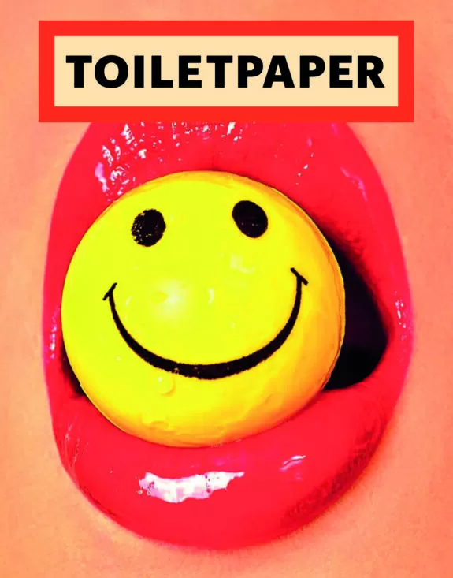

**Typography encompasses a range of design elements when looking at how a magazine is presented to its' audience. Artistic lifestyle and culture magazines such as *Oh Comely, toiletpaper* and *Juxtapoz* utilise certain elements more than others, like imagery and composition.**

Aesthetic magazines that focus on the arts and culture subjects of journalism are more likely to have demographics of people who are cultivated in the arts themselves. This means that there is likely to be a significanct typographic importance on the imagery of such publications seeing as there is demographic interest. 

Take *toiletpaper* as an example, they are a bi-annual publication that acts as an exclusive exhibition of work for their audience. The magazine contains no text. This omission of typeface is a statement as a magazine, as the archetypal magazine will have coverlines and incentives on the cover, buzz words and advertisements throughout; headings, subheadings, bylines and bodies of text for articles. This is the norm for magazine demographics. However, with *toiletpaper* there is a luxury connotation that suggests opulence as a publication. The way that they can convey the meanings of the content without words illustrates stability as a brand. The logo branding and masthead for *toiletpaper* is simple in design, with a sans serif block typeface, thick in width to stand out against the abundance of imagery - the logo implies no artistic flare and instead is just an abbreviation of the masthead with the initials *tp* capitalised in the forground of a heavily saturated background of solid colour. The cover designs for toiletpaper follow the same colour theme, with high saturation and not much contrast between image elements, for example, on the cover of the eighteenth issue the dominant signifier/background is an extreme close-up of a mouth holding a yellow golf ball. Simple enough? The intensity of the red lips against the bright sunshine yellow of the golf ball holds a lack of contrast, with both colours used having similar undertones and high saturation - to the point that there isn't neccessarily an element that stands out over the other. As text is no longer a factor of consideration when looking at typographic decsions made - the composition has no longer a competition for attention, with images no longer battling for eye-catching moments shared with the audience. The imagery absorbs the cover space and so presents the branding for the publication in it's simplest form. Do you like the image? Yes, buy the magazine. No, it's not for you. \
*Toiletpaper* stands out as an outlier in the sphere of artistic magazines, seeing as they omit text completely, however, most art and culture magazines do follow in the same suit of image to text ratio (with more image than text) - just maybe not to such an extreme. 

